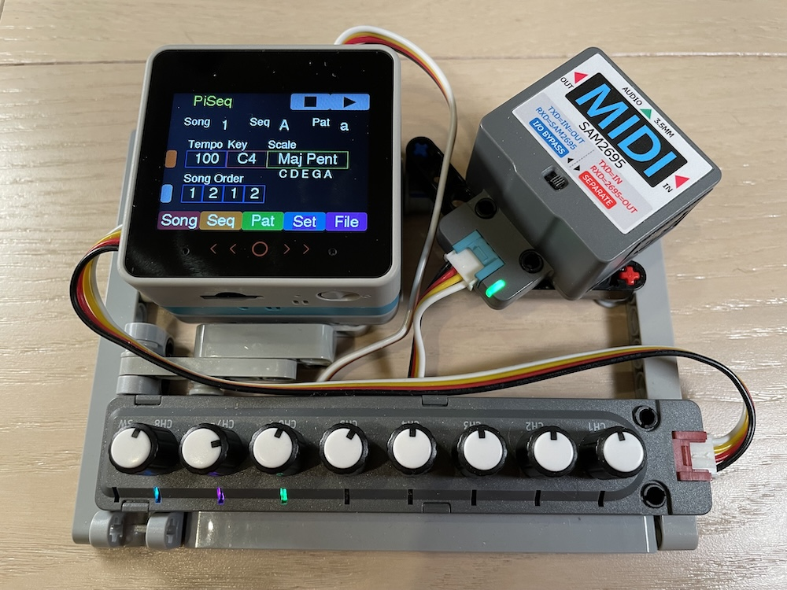
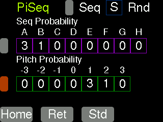

# PiSeq : Pitch Interval Sequencer

[🇯🇵 日本語はこちら](README_ja.md)

A MIDI sequencer built from block combinations with random elements.

### Key Features
- Manage songs in a three-layer block structure: Song, Sequence, and Pattern
- Pitch can be shifted for each sequence or pattern independently
- Some sequences and patterns can be selected randomly
- Songs can be saved to and loaded from a MicroSD card

### Song Structure

A song consists of Song Blocks numbered 1 to 8. Up to 8 blocks can be arranged in sequence, and playback loops back to the beginning after reaching the end.

For example, if set to `1, 2, 1, 2, 3`, playback will follow:
`1, 2, 1, 2, 3, 1, 2, 1, 2, 3, ...`

Each Song Block is made up of sequences labeled A–Z. Up to 8 sequences can be arranged and played in order.

- Sequences A–R define their content using a combination of patterns (explained below).
- Sequences S–Z include random behavior, where one of Sequences A–H is selected at random for playback.
- When arranging up to 8 sequences in a song, each sequence can have an independent pitch shift amount.

For example, setting:
`A: 0, B: 0, A: +2, B: +2`
will result in A and B being played normally the first time, and then played two steps higher the next time using the selected scale.

Each Sequence consists of patterns labeled a–z. Up to 8 patterns can be arranged and played in sequence.

- Patterns a–r define their content explicitly.
- Patterns s–z include randomness and randomly select one of Patterns a–h.
- Each pattern can also be assigned a pitch shift value within the sequence.

For example, setting:
`a: 0, b: 0, a: +2, b: +2`
means that after playing a and b normally, the next a and b will be played two steps higher in the scale.
If the song’s sequence has a pitch shift setting, it will be combined with this.

Each Pattern plays over one quarter note (1 beat), but its rhythm can be selected from the following:

- 1× quarter note
- 2× eighth notes
- 3× dotted sixteenth notes
- 4× sixteenth notes

Each of these note positions can also have an individual pitch shift amount assigned.

### Random Playback

Sequences S–Z and patterns s–z are used for random playback.
You can assign weightings for the probability of selecting from A–H (or a–h).

For example, setting:
`A: 3, B: 1, all others: 0`
means A will be selected 75% of the time, and B 25%.

You can also assign weighted probabilities for pitch shifts from −3 to +3.
For example, setting:
`+1: 3, +2: 1, all others: 0`
means a +1 shift is selected 75% of the time, and +2 shift 25%.

### Scales
You can choose from multiple musical scales. The pitch shifts mentioned above apply to the selected scale, moving up/down in scale steps.

So for a 2-step pitch increase from D:

- In the Chromatic scale : D -> E
- In the Major scale : D -> F
- In the Major Pentatonic scale : D -> G

This ensures that notes outside the selected scale are never played.

Examples:
Scale | Description | Notes
--- | --- | ---
Chromatic | 12-tone (semitones) | C,C#,D,D#,E,F,F#,G,G#,A,A#,B
Major | 7-note scale | C,D,E,F,G,A,B
Minor | 7-note scale | C,D,Eb,F,G,Ab,Bb
Harmonic Minor | 7-note scale | C,D,Eb,F,G,Ab,B
Merodic Minor | 7-note scale | C,D,Eb,F,G,A,B
Major Pentatonic | 5-note scale | C,D,E,G,A
Minor Pentatonic | 5-note scale | C,Eb,F,G,Bb
Miyako-bushi | 5-note scale | C,Db,F,G,Ab
Blues | 6-note scale | C,Eb,F,F#,G,Bb
Whole Tone | 6-note scale | C,D,E,F#,G#,A#
Diminished | 8-note scale | C,Db,Eb,E,Gb,G,A,Bb

