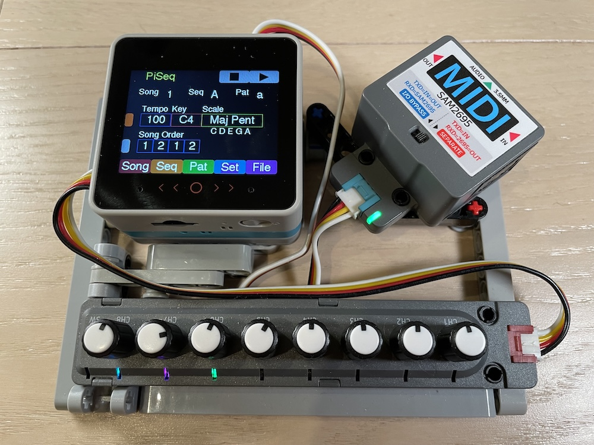
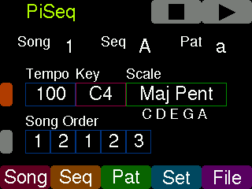
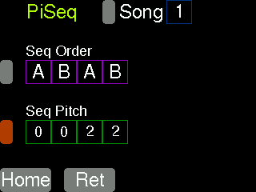
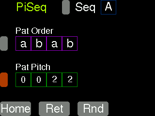
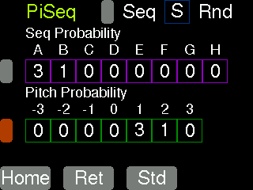

# PiSeq : Pitch Interval Sequencer

ランダムな要素を取り込んだブロックの組み合わせによるMIDIシーケンサです。

### 主な特徴
- 曲を３階層のブロック（ソング、シーケンス、パターン）で管理
- シーケンス、パターンはその単位で音程を上下にシフト可能
- 一部のシーケンス、パターンはランダムに選択することが可能
- MicroSDカードに曲をセーブ、ロードすることが可能

### ハード構成
- M5Stack CoreS3 SE
- M5GO Battery Bottom3
- Midi Unit with DIN Connector (SAM2695)
- 8-Encoder Unit (STM32F030)

### 曲の構造

一つの曲は１〜８の番号で表されるソングで構成され、それらを最大８つ並べて順に演奏し、最後まで行くと先頭に戻ります。

例えば、`１、２、１、２、３`と設定すると、`１、２、１、２、３、１、２、１、２、３、･･･`と演奏されます。

一つのソングはA〜Zのシーケンスで構成され、それらを最大８つ並べて順に演奏します。
シーケンスA〜Rは、後述のパターンの組み合わせで演奏内容が定義されます。
シーケンスS〜Zは、ランダムの要素があり、シーケンスA〜Hのどれかが選ばれて演奏されます。
ソングで８つのシーケンスを並べたときに、それぞれの音程を上下にシフトする量を設定できます。

例えば、`A：０、B：０、A：２、B：２`と設定すると、A、Bを演奏した後、次のA、Bは設定したスケールで２段階音程を高くして演奏します。

一つのシーケンスはa〜zのパターンで構成され、それらを最大８つ並べて順に演奏します。
パターンa〜rは、後述のパターンの組み合わせで演奏内容が定義されます。
パターンs〜zは、ランダムの要素があり、シーケンスa〜hのどれかが選ばれて演奏されます。
シーケンスで８つのパターンを並べたときに、それぞれの音程を上下にシフトする量を設定できます。

例えば、`a：０、b：０、a：２、b：２`と設定すると、a、bを演奏した後、次のa、bは設定したスケールで２段階音程を高くして演奏します。
このとき、ソングの設定でシーケンス自体の音程をシフトしている場合は、それも合わせて調整されます。

一つのパターンは、四分音符一拍の時間で演奏されますが、演奏の仕方を以下から設定します。
四分音符×１、八分音符×２、付点十六分音符×３、十六分音符×４
それぞれについても音程を上下にシフトする量を設定できます。

### ランダムな演奏

シーケンスのS〜Z、パターンのs〜zはランダム演奏を行うためのものです。
A〜H（a〜h）を選ぶ確率の重みづけを設定できます。

例えば、`A：３、B：１、それ以外は０`と設定すると、75%の確率でAが、25%の確率でBが選ばれます。

また、音程のシフトも−３〜＋３まで確率の重みづけを設定できます。
例えば、`＋１：３、＋２：１、それ以外は０`と設定すると、75%の確率で＋１が、25%の確率で＋２が選ばれます。

### スケール
複数のスケールから選択することができます。上述の音程のシフトは選択したスケールに対して１段階、２段階と行います。
したがって、２段階音程を高くするときに、スケールがクロマティックの場合はD→Eに、メジャーの場合は、D→Fに、メジャー・ペンタトニックの場合は、D→Gになります。
つまり、スケール以外の音を出すことはありません。

例
スケール |  | 音名
--- | --- | ---
クロマティック | 半音単位の12音階 | C,C#,D,D#,E,F,F#,G,G#,A,A#,B
メジャー | ７音階 | C,D,E,F,G,A,B
メジャー・ペンタトニック | ５音階 | C,D,E,G,A

